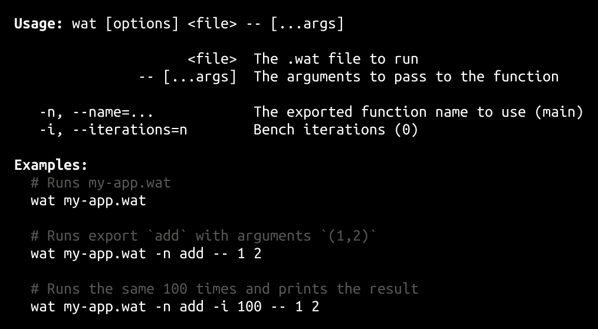

<h1>
wat-cli <a href="https://npmjs.org/package/wat-cli"></a> <a href="src"></a> <a href="https://cdn.jsdelivr.net/npm/wat-cli@1.1.0/dist/wat-cli.min.js"></a> <a href="LICENSE"></a>
</h1>

<p></p>

run .wat files from the command line

<h4>
<table><tr><td title="Triple click to select and copy paste">
<code>npm i wat-cli -g</code>
</td><td title="Triple click to select and copy paste">
<code>pnpm add wat-cli -g</code>
</td><td title="Triple click to select and copy paste">
<code>yarn global add wat-cli</code>
</td></tr></table>
</h4>

## CLI

<p></p>
<p>

</p>

## Examples

<details id="example$basic" title="basic" open><summary><span><a href="#example$basic">#</a></span>  <code><strong>basic</strong></code></summary>  <ul>    <details id="source$basic" title="basic source code" open><summary><span><a href="#source$basic">#</a></span>  <code><strong>view source</strong></code></summary>  <a href="example/basic.ts">example/basic.ts</a>  <p>

```ts
import { Options, run } from 'wat-cli'

console.log(
  run(
    new Options({
      file: __dirname + '/math.wat',
      args: [1, '2'],
      name: 'add',
    })
  )
)
```

</p>
</details></ul></details>

## API

<p>  <details id="Options$1" title="Class" ><summary><span><a href="#Options$1">#</a></span>  <code><strong>Options</strong></code>    </summary>  <a href="src/index.ts#L6">src/index.ts#L6</a>  <ul>        <p>  <details id="constructor$7" title="Constructor" ><summary><span><a href="#constructor$7">#</a></span>  <code><strong>constructor</strong></code><em>(opts)</em>    </summary>  <a href="src/index.ts#L18">src/index.ts#L18</a>  <ul>    <p>  <details id="new Options$8" title="ConstructorSignature" ><summary><span><a href="#new Options$8">#</a></span>  <code><strong>new Options</strong></code><em>()</em>    </summary>    <ul><p><a href="#Options$1">Options</a></p>      <p>  <details id="opts$9" title="Parameter" ><summary><span><a href="#opts$9">#</a></span>  <code><strong>opts</strong></code>  <span><span>&nbsp;=&nbsp;</span>  <code>{}</code></span>  </summary>    <ul><p><span>Partial</span>&lt;<a href="#Options$1">Options</a>&gt;</p>        </ul></details></p>  </ul></details></p>    </ul></details><details id="args$11" title="Property" ><summary><span><a href="#args$11">#</a></span>  <code><strong>args</strong></code>  <span><span>&nbsp;=&nbsp;</span>  <code>[]</code></span>  </summary>  <a href="src/index.ts#L8">src/index.ts#L8</a>  <ul><p>string | number  []</p>        </ul></details><details id="file$10" title="Property" ><summary><span><a href="#file$10">#</a></span>  <code><strong>file</strong></code>    </summary>  <a href="src/index.ts#L7">src/index.ts#L7</a>  <ul><p>string</p>        </ul></details><details id="iterations$13" title="Property" ><summary><span><a href="#iterations$13">#</a></span>  <code><strong>iterations</strong></code>  <span><span>&nbsp;=&nbsp;</span>  <code>0</code></span>  </summary>  <a href="src/index.ts#L10">src/index.ts#L10</a>  <ul><p>number</p>        </ul></details><details id="name$12" title="Property" ><summary><span><a href="#name$12">#</a></span>  <code><strong>name</strong></code>  <span><span>&nbsp;=&nbsp;</span>  <code>'main'</code></span>  </summary>  <a href="src/index.ts#L9">src/index.ts#L9</a>  <ul><p>string</p>        </ul></details><details id="examples$2" title="Property" ><summary><span><a href="#examples$2">#</a></span>  <code><strong>examples</strong></code>  <span><span>&nbsp;=&nbsp;</span>  <code>...</code></span>  </summary>  <a href="src/index.ts#L12">src/index.ts#L12</a>  <ul><p>{<p>  <details id="my-app.wat$4" title="Property" ><summary><span><a href="#my-app.wat$4">#</a></span>  <code><strong>my-app.wat</strong></code>  <span><span>&nbsp;=&nbsp;</span>  <code>'Runs my-app.wat'</code></span>  </summary>    <ul><p>string</p>        </ul></details><details id="my-app.wat -n add -- 1 2$5" title="Property" ><summary><span><a href="#my-app.wat -n add -- 1 2$5">#</a></span>  <code><strong>my-app.wat -n add -- 1 2</strong></code>  <span><span>&nbsp;=&nbsp;</span>  <code>'Runs export `add` with arguments `(1,2)`'</code></span>  </summary>    <ul><p>string</p>        </ul></details><details id="my-app.wat -n add -i 100 -- 1 2$6" title="Property" ><summary><span><a href="#my-app.wat -n add -i 100 -- 1 2$6">#</a></span>  <code><strong>my-app.wat -n add -i 100 -- 1 2</strong></code>  <span><span>&nbsp;=&nbsp;</span>  <code>'Runs the same 100 times and prints the result'</code></span>  </summary>    <ul><p>string</p>        </ul></details></p>}</p>        </ul></details><details id="code$14" title="Accessor" ><summary><span><a href="#code$14">#</a></span>  <code><strong>code</strong></code>    </summary>  <a href="src/index.ts#L22">src/index.ts#L22</a>  <ul>        </ul></details><details id="parsedArgs$16" title="Accessor" ><summary><span><a href="#parsedArgs$16">#</a></span>  <code><strong>parsedArgs</strong></code>    </summary>  <a href="src/index.ts#L26">src/index.ts#L26</a>  <ul>        </ul></details></p></ul></details><details id="bench$21" title="Function" ><summary><span><a href="#bench$21">#</a></span>  <code><strong>bench</strong></code><em>(options)</em>    </summary>  <a href="src/index.ts#L43">src/index.ts#L43</a>  <ul>    <p>    <details id="options$23" title="Parameter" ><summary><span><a href="#options$23">#</a></span>  <code><strong>options</strong></code>    </summary>    <ul><p><a href="#Options$1">Options</a></p>        </ul></details>  <p><strong>bench</strong><em>(options)</em>  &nbsp;=&gt;  <ul>void</ul></p></p>    </ul></details><details id="benchWat$27" title="Function" ><summary><span><a href="#benchWat$27">#</a></span>  <code><strong>benchWat</strong></code><em>(fnName, params, iterations)</em>    </summary>  <a href="src/index.ts#L70">src/index.ts#L70</a>  <ul>    <p>    <details id="fnName$29" title="Parameter" ><summary><span><a href="#fnName$29">#</a></span>  <code><strong>fnName</strong></code>    </summary>    <ul><p>string</p>        </ul></details><details id="params$30" title="Parameter" ><summary><span><a href="#params$30">#</a></span>  <code><strong>params</strong></code>    </summary>    <ul><p>string</p>        </ul></details><details id="iterations$31" title="Parameter" ><summary><span><a href="#iterations$31">#</a></span>  <code><strong>iterations</strong></code>    </summary>    <ul><p>number</p>        </ul></details>  <p><strong>benchWat</strong><em>(fnName, params, iterations)</em>  &nbsp;=&gt;  <ul>string</ul></p></p>    </ul></details><details id="getInstance$24" title="Function" ><summary><span><a href="#getInstance$24">#</a></span>  <code><strong>getInstance</strong></code><em>(code)</em>    </summary>  <a href="src/index.ts#L64">src/index.ts#L64</a>  <ul>    <p>    <details id="code$26" title="Parameter" ><summary><span><a href="#code$26">#</a></span>  <code><strong>code</strong></code>    </summary>    <ul><p>string</p>        </ul></details>  <p><strong>getInstance</strong><em>(code)</em>  &nbsp;=&gt;  <ul><span>Instance</span></ul></p></p>    </ul></details><details id="run$18" title="Function" ><summary><span><a href="#run$18">#</a></span>  <code><strong>run</strong></code><em>(options)</em>     &ndash; Runs a function in a .wat file with the given arguments.</summary>  <a href="src/index.ts#L34">src/index.ts#L34</a>  <ul>    <p>    <details id="options$20" title="Parameter" ><summary><span><a href="#options$20">#</a></span>  <code><strong>options</strong></code>    </summary>    <ul><p><a href="#Options$1">Options</a></p>        </ul></details>  <p><strong>run</strong><em>(options)</em>  &nbsp;=&gt;  <ul>unknown</ul></p></p>    </ul></details></p>

## Credits

- [decarg](https://npmjs.org/package/decarg) by [stagas](https://github.com/stagas) &ndash; decorator based cli arguments parser
- [wat-compiler](https://npmjs.org/package/wat-compiler) by [stagas](https://github.com/stagas) &ndash; webassembly wat text format to binary compiler

## Contributing

[Fork](https://github.com/stagas/wat-cli/fork) or [edit](https://github.dev/stagas/wat-cli) and submit a PR.

All contributions are welcome!

## License

<a href="LICENSE">MIT</a> &copy; 2022 [stagas](https://github.com/stagas)
